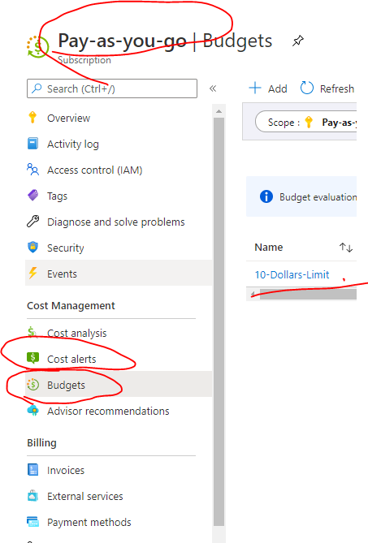

# Exploring Azure - Setting Budget Alerts & Introduction to Azure Virtual Machines

## Introduction

✍️ It's always good to set some sort of budget alerts to prevent shock of the cloud bills. After configuring budgets alert, it's time to get my hand dirty with the Azure VMs.

## Prerequisite

✍️ You need to have at least a pay-as-you-go subscription before you can create budget alerts. Free trial and Microsoft Imagine subscriptions cannot create budget alerts.

✍️ You need to have a subscription (free trial / pay-as-you-go) etc to create virtual machine.

## Cloud Research

- ✍️ Clicking on "Cost alerts" to create the budget alert is the same as clicking on "Budgets" under the respective subscription.
- 

## Try yourself

✍️ Tutorial on how to create budget alerts 
- [Tutorial: Create and manage Azure budgets](https://docs.microsoft.com/en-us/azure/cost-management-billing/costs/tutorial-acm-create-budgets)

✍️ Introduction to Azure Virtual Machines
- [Introduction to Azure virtual machines](https://docs.microsoft.com/en-us/learn/modules/intro-to-azure-virtual-machines/)

## ☁️ Cloud Outcome

✍️ My bills will not overshot 10 bucks as I will stop the services when the budget alert triggered (90% of the 10 bucks threshold) and will notify me through email.

✍️ I now understood that before even thinking about creating VMs, we should think about communications and network first. Always plan before executing.

## What I have learnt
### Setting Budget Alerts
- What is the difference between a Budget Alert and a Credit Alert?
    - Budget alert is used for pay-as-you-go subscription whereas credit alert is used from enterprise level subscription such as Microsoft MSDN Azure subscription.
- What is the cost for creating Cost Alerts?
    - It's free to create cost alerts in MS Azure :D
- When a cost alert is triggered how will you know?
    - A cost alert will be triggered based on the threshold which is 9 dollars for me and it will notify me via email.
- Under what service in the Azure Portal do you find Cost Alerts?
    - Under the Subscriptions -> your_subscription -> Cost Management: your_subscription -> Budgets.
### Azure Virtual machines
- Which VM workload option is best to run a network appliance on?
    - Compute-optimized VM
- Is an ARM template is a JSON file?
    - Yes
- What is Azure Backup?
    - Backup as a service to ensure all your data are backed up
- What are some advantages of using Azure Backup?
    - Regardless of physical or VM data, services like Microsoft SharePoint and on-premises to on cloud, the data all can be backed up.
- What is availability?
    - It is an indicator on the uptime of the service such as Azure VM.
- What is an availability set?
    - It is an logical feature that ensure a group of VM are deployed but won't subject to a single point of failure and not all VMs will be upgraded all at once in order to ensure redundancy.
- What is a fault domain?
    - It is similar to a rack at a physical center just that it is at a different physical center to provide higher redundancy.
- What is an update domain?
    - It is an logical group of VMs undergo updates and maintenance at the same time.

## Next Steps

✍️ I will be diving into Azure networking.

## Social Proof

✍️ Show that you shared your process on Twitter or LinkedIn

[link](link)

## Project/topic references
- [Exploring Azure - Setting Budget Alerts](https://github.com/100DaysOfCloud/100DaysOfCloudIdeas/blob/master/Projects/BIL/BIL01/BIL01-AZ100.md)
- [COM03-AZ100 - Introduction to Azure virtual machines](https://github.com/100DaysOfCloud/100DaysOfCloudIdeas/blob/master/Projects/COM/COM03/COM03-AZ100.md)

## PS
- Place holder image taken from Microsoft docs website.
